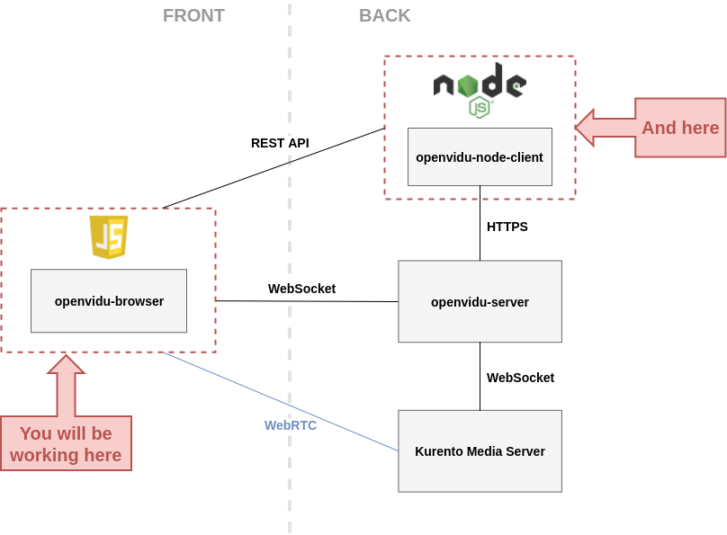

# EC601 Term Project- Analysis of OpenVidu and other WebRTC Applications

WebRTC is one of the most popular real-time communication protocol which can build on top of your browser. It is supported by every major browser and countless popular products utilize its versatility such as Facebook Messenger, Discord, and Google Hangouts.

One of the biggest challenges which these products prioritize is the security surrounding the communications and personal information of their users. Privacy is a necessity and even the smallest exposure of proprietary user data could have a significant effect on the product as well as the victims involved. In order to prevent any successful attacks on any WebRTC apps, we will do an analysis of WebRTC by creating our own sample system using the protocol and will attempt several tests and angles of analysis in order to further underestand the details of WebRTC and the security it offers and/or needs. 

Specifically, we are trying to create our own communication portal using Openvidu, an open source framework that supports real-time video and audio meeting app (using the WebRTC protocol). Initially, we will be implementing local examples of Openvidu and then move to online implementations using AWS to host our necessary servers.


From there, we will start our security analysis by using WireShark to monitor the data packet traffic to see if we can find a security weakness in our platform. In addition, we will also monitor the logs on our AWS instance to see if any logs that OpenVidu produces are exposing client info.

The specific experiments we chose to accomplish are the following:
- Communications Layer Attack
- DoS Attack
- Signalling Layer Attack

On a side note, we also want to examine the vulnerability of peer-to-peer communications with WebRTC but Openvido doesn't support it yet. So we will use another simple WebRTC example to see if we can build a peer-to-peer communication software and anaylze the vulnerability.

## Technical Approach
In this section, we will go in detail of our implementations and experiments.
### Local Implementations - Sprint 1 + 2
 Our first step is to just get a simple bare-bones instance up and running on a local machine. In order to achieve this, we followed the tutorials located on the 
 <a href="https://docs.openvidu.io/en/2.15.0/tutorials/" title="Openvidu Docs">Openvidu Documentation</a> 
 webpage. The specific tutorial we chose was the one called "openvidu-js-node" which includes 



### AWS Implementation - Sprint 3
Once our local implementation was up and running without any issues, we deployed an instance on AWS in order to further mimic a standard use-case. We use the Openvidu Call Application S3 template in order to start off our deployment on the AWS Cloudformation Stack. From there, we supply our stack with an Elastic IP which is tied to the domain which we want to host our application at. 

The domain supplied needs to be a FQDN (Fully Qualified Domain Name) and not a website hosted at a static URL. This can all be done on Amazon Route 53 and here is a  <a href="https://aws.amazon.com/getting-started/hands-on/get-a-domain/#:~:text=Fully%20Qualified%20Domain%20Name%20(FQDN),-b.&text=b.-,Click%20the%20Create%20Record%20Set%20button.,resources%20that%20you%20have%20available." title="Domain Registration">link</a> to the walkthrough we used to create our FQDN.

Here is a general overview <a href="https://docs.openvidu.io/en/2.15.0/deployment/deploying-aws/" title="Deploying on AWS">link</a> to the tutorial we followed in order to deploy onto AWS.

For more details, check our code section README for a step by step walkthrough of how to deploy onto AWS.

During our deployment process, we were having issues creating our stack and getting our application to properly deploy at our domain but resolved the issues by 

### Security Analysis - Communication Layer - Sprint 4
#### Client side monitor

To do so, we can use Wireshark on any operating system. Once we open the Wireshark and filter the source and destination IP using our elastic IP address. We can monitor all the traffic out and from our elastic IP to our IP address. We simulate a scenario that one user enter the OpenVidu website and create a session. Then, the other user join this session. Both users turn on the audio and camera. They also leave some message and then leave the session. This is one of the most common scenario in our life. Using the Wireshark,  we can sniff all the data between me and the server. We may find some useful data which may leak some credential information. Here is a sample we found.

This figure shows that our encrypted username is actually keep changing in different stage, which is a good method to keep the username safe. However, the other protocol, like the ARP, will leak the IP and MAC address by broadcasting them, which is not the problem of the WebRTC. The other thing we found is that the chat message is actually encrypted using TSL. To read more,  the pcap file is in the "Files" folder and the file name is "webrtc".

#### Server side monitor

To monitor traffic from server, we need to do some work to do so.  To make life easier, we use the pem file to connect to our EC instance and install the vncserver.

```
sudo apt-get update
sudo apt-get upgrade
sudo apt-get install ubuntu-desktop gnome-panel gnome-settings-daemon metacity nautilus gnome-terminal xfce4 vnc4server
```

Then, to make the vncserver works, we need to configurate the ~/.vnc/xstarup file by replacing the all the contents with this.

```
#!/bin/sh
# Uncomment the following two lines for normal desktop:
unset SESSION_MANAGER
# exec /etc/X11/xinit/xinitrc
unset DBUS_SESSION_BUS_ADDRESS
startxfce4 &
[ -x /etc/vnc/xstartup ] && exec /etc/vnc/xstartup
[ -r $HOME/.Xresources ] && xrdb $HOME/.Xresources
xsetroot -solid grey
vncconfig -iconic &
gnome-panel &
gnome-settings-daemon &
metacity &
nautilus &
gnome-terminal &
```

Then, we can logout the instance and login into it using port forwarding and start the vncserver.

```
ssh -L 5902:localhost:5902 -i amazon.pem ubuntu@ec2–52–90–172–228.compute-1.amazonaws.com
vncserver -geometry 1340x750
```

After that, we can use vncviewer and connect to the localhost:5902. Now, you can have a GUI for our server and install the Wireshark.

We also simulate the same scenario for our this one. On the server side, we can have more information than client side. For example, we can see how STUN server binding the virtual address to certain username.


Also, we can sniff that how the server and client exchange the encryption method using UDP.


In this pcap file, we can see how the WebRTC actually works like how they establish connection between users using UDP, TCP, STUN and TURN to find the best way to establish communication. This method is called Interactive Connectivity Establishment, ICE. To read more, find the "server" under the "Files"
PCAP files links:
https://drive.google.com/file/d/1N3gEzFzUonNOHwKUF46JfZpZDEyxpjPt/view?usp=sharing,%20
https://drive.google.com/file/d/1xTf4Jl5jkMAmzxBjolcrH-xnR70tU82a/view?usp=sharing
### Security Analysis - DoS Attacks - Sprint 4 
Another popular angle attack is to do a Denial of Service attack (DoS). 


### Security Analysis - Signalling Layer - Sprint 5


In our final sprint, we decided to deploy an attack onto the signalling layer of our application. This took the form of a Man in the Middle(MiTM) attack. MiTM attacks in our application could take place in two different places. They could either be a phishing attack between the server and client or in between two clients directly. We chose to take the approach of a phishing attack as these are more common and more practical for hackers to pull off. A phishing attack is when a third party acts as some trusted component of the application the attack is based on. Popular phishing attempts include pop-ups pretending to be Microsoft and saying your PC 'needs' attentiion or fake webpages asking for autentication in order to steal credentials off their victims. 

In order to pull off an attack, we use the open-source project evilginx2. Evilginx2 is a CLI application which makes the art of phising easy for anyone. Although the package seems to be a bad idea and promote malicious behavior, it is actually used as a research tool and to do exactly what we are doing, research ethods to defend against phishing attacks.

First, we create a custom phishlet, a webpage to 'act' as the legitimate service, from a copy of the html used in Openvidu's "Create a Room" web page:


From here, we inspect what tag is used for the form where the user enters their unique session code in order to join or create a room. This tag is called "roomInput' and we specify in evilginx what tag we are looking to 'steal' from our victims on our copied webpage. Then, evilginx sets up our Let's encrypt certificates and hosts the fake webpage at a specificed domain with a secured connection. In order to simulate a victim falling for our phishing attack, we just access the URL of the fake webpage and input some unique code for our sesion. Evilginx2 takes the input data, saves it, and redirects the user to the legitimate site after inputting the data the user originally entered. This is so the user won't even be aware that they just got phished while the hackers run off with the stolen credentials. 

We found that Openvidu does not implement any protection to phishing attacks because once a hacker has the unique string ID of a room, they are free to enter and listen as they please. There are no security features implemented that stop one from doing so and there are many very simple ones that Openvidu can choose to implement. One such is any


## Conclusion 

The MVP for our product should be able to hold a virtual meeting with audio and video.
Our user is anyone who need to hold meeting or attend meeting but unable to do so physically.
The user story is, for example, a professor in college do the lecture online and all of his/her students are attending this meeting at the same time with audio and video connection.

## References

https://medium.com/@Arafat./graphical-user-interface-using-vnc-with-amazon-ec2-instances-549d9c0969c5

https://medium.com/@macsat101/packet-sniffing-using-wireshark-on-aws-183b7983685d

