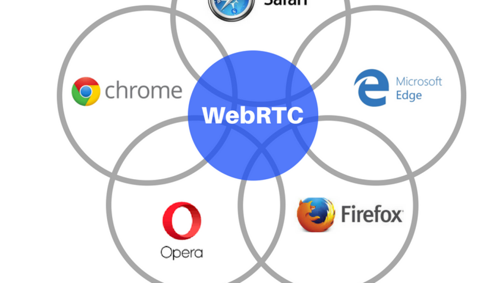

EC601 Term Project- Analysis of OpenVidu and other WebRTC Applications
## Introduction

WebRTC is one of the most popular real-time communication protocol which can build on top of your browser. It is supported by every major browser and countless popular products utilize its versatility such as Facebook Messenger, Discord, and Google Hangouts.

One of the biggest challenges which these products prioritize is the security surrounding the communications and personal information of their users. Privacy is a necessity and even the smallest exposure of proprietary user data could have a significant effect on the product as well as the victims involved. In order to prevent any successful attacks on any WebRTC apps, we will do an analysis of WebRTC by creating our own sample system using the protocol and will attempt several tests and angles of analysis in order to further underestand the details of WebRTC and the security it offers and/or needs. 

Specifically, we are trying to create our own communication portal using Openvidu, an open source framework that supports real-time video and audio meeting app (using the WebRTC protocol). Initially, we will be implementing local examples of Openvidu and then move to online implementations using AWS to host our necessary servers.

From there, we will start our security analysis by using WireShark to monitor the data packet traffic to see if we can find a security weakness in our platform. In addition, we will also monitor the logs on our AWS instance to see if any logs that OpenVidu produces are exposing client info.

(INSERT FUTURE EXPERIMENTS HERE)

On a side note, we also want to examine the vulnerability of peer-to-peer communications with WebRTC but Openvido doesn't support it yet. So we will use another simple WebRTC example to see if we can build a peer-to-peer communication software and anaylze the vulnerability.

## MVP + User Story

The MVP for our product should be an instance o OpenVidu that is able to create a session and hold a virtual meeting with audio and video.

=======

WebRTC is one of the most popular real-time communication frameworks which can build on top of your browser. Unlike online meeting services in the past, WebRTC do not need any plug-in application to run a virtual meeting on your browser, which lower the risk from security issue. Especially in the pandemic, we hold a lot of important meeting online. The security of our communication is crucial for everyone. In this case, we are trying to create our own communication portal using Openvido framework locally and hopefully we can set up an AWS server to run it. Also, we will analyze the data packet traffic to see if we can find a security weakness in our platform. On the other hand, we want to examine the vulnerability of peer-to-peer communication, however, the Openvido doesn't support that for now, so we will use another simple WebRTC example to see if we can build a peer-to-peer communication software and anaylze the vulnerability.

## Technical Approach - Brian
In this section, we will go in detail of our implementations and experiments.
### Local Implementations
 Our first step is to just get a simple bare-bones instance up and running on a local machine. In order to achieve this, we followed the tutorials located on the 
 <a href="https://docs.openvidu.io/en/2.15.0/tutorials/" title="Openvidu Docs">Openvidu Documentation</a> 
 webpage. The specific tutorial we chose was the one called "openvidu-js-node" which includes 

## Authentication Replacement
(Talk about using a Database to support authentication)

### AWS Implementation
Once our local implementation was up and running without any issues, we deployed an instance on AWS in order to further mimic a standard use-case. 

### Security Analysis
In this section, we will talk about the experiments we did in order to evaluate security efforts from Openvidu.
#### Wireshark - Data Stream Security

#### 

## Conclusion

The MVP for our product should be able to hold a virtual meeting with audio and video.
Our user is anyone who need to hold meeting or attend meeting but unable to do so physically.
The user story is, for example, a professor in college do the lecture online and all of his/her students are attending this meeting at the same time with audio and video connection.

## References
